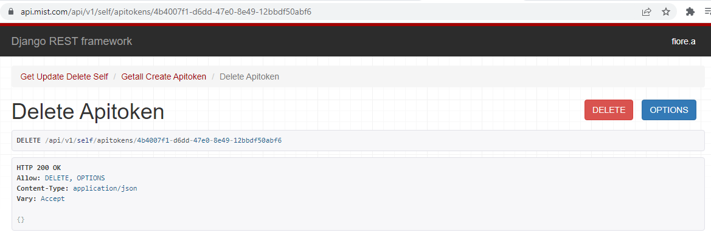

# Delete API Token #

## Instructions ##

After logging into <https://manage.mist.com> Navigate to <https://api.mist.com/api/v1/self/apitokens/>[Your_API_Token_ID_goes_here]

You can find your Token's ID from the List API section of this repo. In this example I'm using "4b4007f1-d6dd-47e0-8e49-12bbdf50abf6" but that will be different for you.

You will see an error about the method "GET" not being allowed, which is fine. This was sent to get us to the page then processed as an error since we need to send a DELETE instead. Click on the "DELETE" button and if it worked it will post a response like the image below. We're mostly looking for the "HTTP 200 OK" but it will tell you in the payload if something goes wrong. You can go back to the List API section of this repo and check to see if it was removed that way too.

