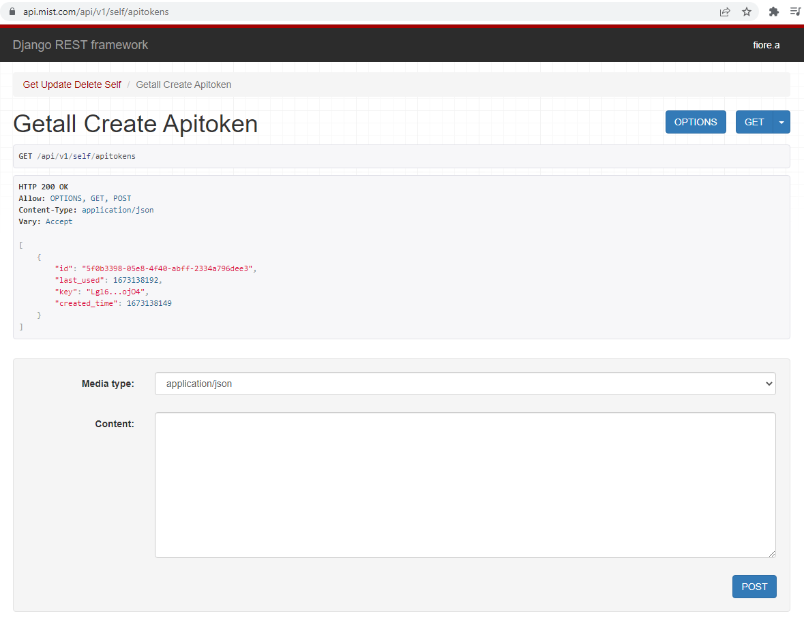

# List API Token #

## Instructions ##

After logging into <https://manage.mist.com> Navigate to <https://api.mist.com/api/v1/self/apitokens>

Notice how it doesn't output the entire token. You will only ever see the entire token at creation. This is how you can get the token ID's in case you want to delete one.

